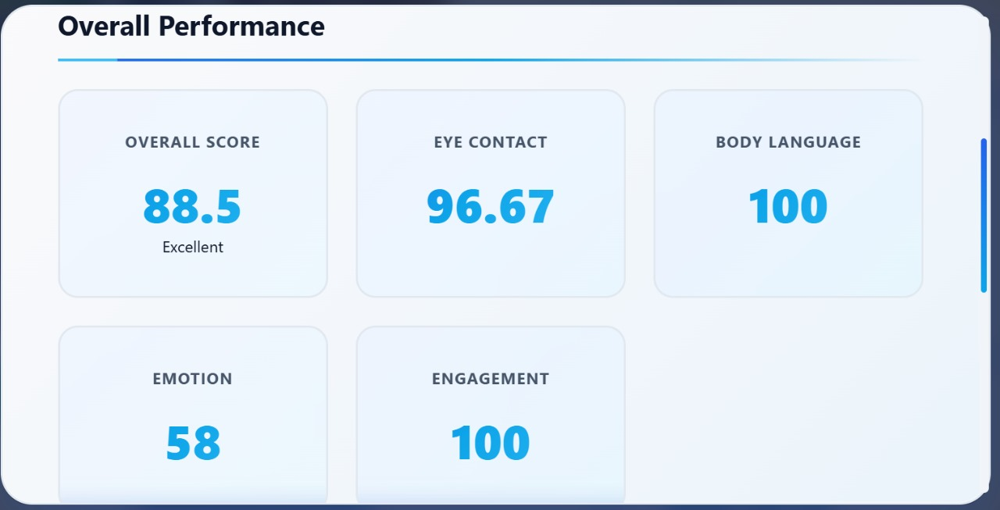
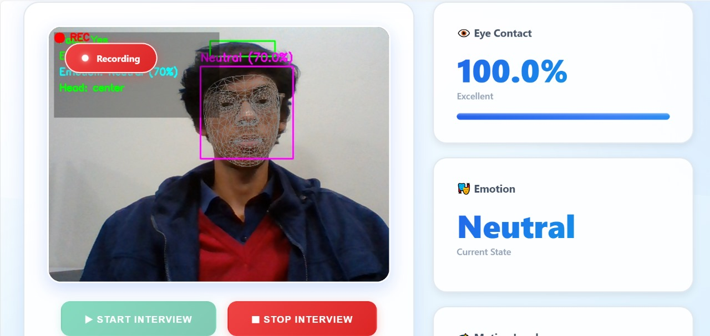
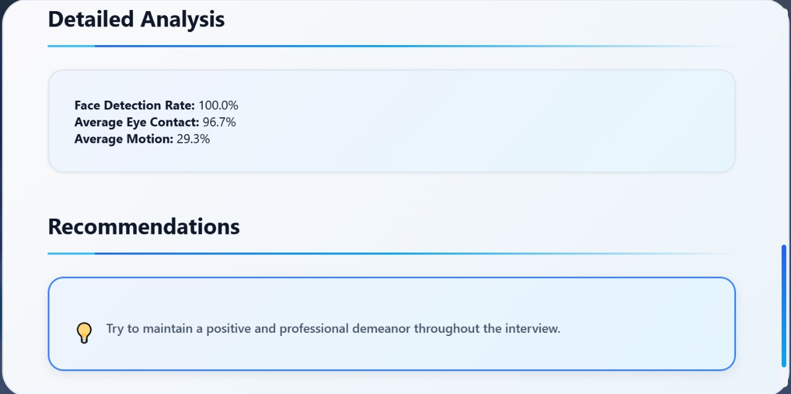

# 🎯 AI Interview Analyzer

A cutting-edge real-time AI-powered interview analysis system featuring **multimodal emotion recognition**, combining facial expression analysis with speech emotion detection using state-of-the-art deep learning models including **Wav2Vec2** and **FER2013 CNN**.


## 📸 Screenshots

### Live Interview Analysis

*Real-time face detection with emotion recognition, eye contact monitoring, and speech emotion analysis running simultaneously*

### Overall Performance Dashboard

*Comprehensive multimodal performance metrics including facial emotion score, speech emotion score, eye contact, positivity, and overall confidence rating*

### Detailed Analysis & Recommendations

*In-depth session analysis with emotion distribution charts, time-series data, and AI-generated personalized recommendations*

## ✨ Features

### 🎥 Real-Time Facial Analysis
- **Face Detection & Tracking**: Real-time face detection using MediaPipe with OpenCV Haar Cascade fallback
- **Facial Emotion Recognition**: CNN-based emotion detection trained on FER2013 dataset
- **7 Emotion Classes**: Angry, Disgust, Fear, Happy, Sad, Surprise, Neutral
- **Eye Contact Monitoring**: Precise tracking to measure eye contact percentage with camera
- **Confidence Smoothing**: Rolling average for stable, flicker-free emotion predictions

### 🎤 Real-Time Speech Emotion Analysis
- **HuggingFace Wav2Vec2 Model**: State-of-the-art transformer-based speech emotion recognition
- **8 Emotion Classes**: Neutral, Calm, Happy, Sad, Angry, Fearful, Disgust, Surprised
- **Live Audio Processing**: Continuous 3-second audio chunk analysis
- **RAVDESS-trained Fallback**: Secondary CNN model trained on RAVDESS dataset
- **Voice Activity Detection**: Intelligent speech detection before analysis

### 🔮 Multimodal Fusion Engine
- **Weighted Score Fusion**: Combines facial (40%) + speech (35%) + eye contact (15%) + vocal confidence (10%)
- **Interview-Appropriate Scoring**: Emotions weighted based on professional context
- **Real-Time Score Updates**: Live dashboard with continuous analytics
- **Intelligent Recommendations**: AI-generated improvement suggestions based on performance

### 📊 Performance Metrics
- **Overall Interview Score**: Comprehensive weighted scoring system (0-100)
- **Facial Emotion Score**: Based on emotion appropriateness and confidence
- **Speech Emotion Score**: Evaluates vocal emotional tone and delivery
- **Eye Contact Score**: Measures and rates eye contact quality
- **Positivity Score**: Tracks positive vs negative emotion ratio
- **Session Duration Tracking**: Monitors interview length and engagement

### 📑 Reporting System
- **Real-Time Statistics**: Live dashboard with continuous updates
- **Detailed JSON Reports**: Comprehensive reports with all metrics saved automatically
- **Emotion Distribution Charts**: Visual breakdown of detected emotions
- **Personalized Recommendations**: Priority-based improvement suggestions
- **Session History**: Track and compare multiple interview sessions

## 🚀 Installation

### Prerequisites
- Python 3.8 or higher
- Webcam (built-in or external)
- Microphone (for speech analysis)
- Windows/Linux/macOS

### Step 1: Clone or Download
```bash
# If using git
git clone https://github.com/MuhammadAli-A/AI_Project.git
cd ai-interview-analyzer

# Or download and extract the ZIP file
```

### Step 2: Create Virtual Environment (Recommended)
```bash
# Windows
python -m venv venv
venv\Scripts\activate

# Linux/macOS
python3 -m venv venv
source venv/bin/activate
```

### Step 3: Install Dependencies
```bash
pip install -r requirements.txt
```

### Required Dependencies
```
flask>=2.0.0
flask-cors>=4.0.0
opencv-python>=4.8.0
numpy>=1.24.0
mediapipe>=0.10.0
tensorflow>=2.10.0
torch
transformers>=4.30.0
librosa>=0.10.0
soundfile>=0.12.0
scipy>=1.10.0
sounddevice>=0.4.6
```

**Special Note for Windows Users - Audio Dependencies:**

If you encounter issues with audio processing:

```powershell
# Install sounddevice for microphone access
pip install sounddevice

# For PyAudio (alternative audio backend)
pip install pipwin
pipwin install pyaudio
```

### Step 4: Download Pre-trained Models

The system uses the following pre-trained models:

| Model | Purpose | Location |
|-------|---------|----------|
| `facial_emotion_model.h5` | FER2013 facial emotion | `models/` |
| `fer2013_model.h5` | Backup facial model | `models/` |
| `ravdess_cnn.h5` | RAVDESS speech emotion | `models/` |
| `speech_emotion_model.h5` | Backup speech model | `models/` |

The HuggingFace Wav2Vec2 model (`ehcalabres/wav2vec2-lg-xlsr-en-speech-emotion-recognition`) is downloaded automatically on first run (~300MB).

### Step 5: Verify Installation
```bash
python -c "import cv2, mediapipe, tensorflow, torch, transformers; print('All dependencies installed successfully!')"
```

### Step 6: Run the Application
```bash
python app.py

# Or use the batch file on Windows
run.bat
```

**Note**: First run may take 2-5 minutes as it downloads the HuggingFace Wav2Vec2 model for speech emotion recognition.

## 📖 Usage

### Starting the Application

1. **Activate Virtual Environment** (if not already active):
   ```bash
   # Windows
   venv\Scripts\activate
   
   # Linux/macOS
   source venv/bin/activate
   ```

2. **Run the Application**:
   ```bash
   python app.py
   ```
   
   You should see:
   ```
   ============================================================
      🎯 AI INTERVIEW ANALYZER
      Real-time Facial & Speech Emotion Analysis
   ============================================================
   
   ✓ Access the application at: http://localhost:5000
   ```

3. **Access the Web Interface**:
   - Open your browser and navigate to: `http://localhost:5000`
   - Allow camera and microphone permissions when prompted

### Using the Interface

1. **Start Interview**:
   - Click "▶ Start Interview" button
   - Position yourself in front of the camera
   - Ensure good lighting and clear face visibility
   - The system will start analyzing both facial expressions and speech

2. **During Interview**:
   - Watch real-time statistics in the analytics panel:
     - **Facial Emotion**: Current detected facial expression with confidence
     - **Speech Emotion**: Detected vocal emotion from your voice
     - **Eye Contact**: Percentage of time maintaining camera eye contact
     - **Positivity**: Overall positive emotion ratio
   - Recording indicator (red dot) shows active session
   - Audio indicator shows speech analysis is running

3. **Stop Interview**:
   - Click "⏹ End Interview" when done
   - Report will be automatically generated and saved
   - View comprehensive multimodal performance analysis

4. **View Report**:
   - Click "📊 View Report" to see detailed analysis
   - Reports are saved in the `reports/` directory as JSON files
   - Review scores, emotion distributions, and recommendations

## 📊 Understanding the Scores

### Overall Score (0-100)
Weighted multimodal average combining facial and speech analysis:
- **85-100**: Excellent - Outstanding interview performance with positive emotions and strong engagement
- **70-84**: Good - Solid performance demonstrating confidence and professionalism
- **55-69**: Average - Acceptable performance with room for improvement
- **40-54**: Below Average - Significant areas requiring attention
- **0-39**: Needs Improvement - Focus on fundamentals and practice

### Multimodal Fusion Weights

| Component | Weight | Description |
|-----------|--------|-------------|
| Facial Emotion | 40% | Appropriateness of facial expressions |
| Speech Emotion | 35% | Vocal emotional tone and delivery |
| Eye Contact | 15% | Camera engagement and focus |
| Vocal Confidence | 10% | Speech clarity and assurance |

### Emotion Appropriateness Scores

**Positive for Interviews:**
- Happy: 90 points
- Calm: 85 points
- Neutral: 75 points

**Neutral/Acceptable:**
- Surprise: 60 points

**Negative for Interviews:**
- Sad: 40 points
- Fear/Fearful: 35 points
- Angry: 25 points
- Disgust: 20 points

### Individual Metrics

#### Facial Emotion Score
- Analyzes facial expressions using the FER2013-trained CNN model
- Detects 7 emotions: Angry, Disgust, Fear, Happy, Sad, Surprise, Neutral
- Uses confidence smoothing for stable predictions
- **Target**: Maintain Happy/Neutral expressions

#### Speech Emotion Score
- Analyzes voice using HuggingFace Wav2Vec2 transformer model
- Detects 8 emotions: Neutral, Calm, Happy, Sad, Angry, Fearful, Disgust, Surprised
- Real-time 3-second audio chunk analysis
- **Target**: Calm, confident vocal delivery

#### Eye Contact Score
- Measures percentage of time maintaining eye contact with camera
- Tracks face position and gaze direction
- **Target**: 60-70% eye contact is optimal
- **Tips**: Look directly at the camera lens, not the screen

#### Positivity Score
- Ratio of positive emotions (Happy, Calm, Neutral) to total emotions
- Combined from both facial and speech analysis
- **Target**: Above 70% positive emotion ratio

## 🏗️ Project Structure

```
ai-interview-analyzer/
├── app.py                          # Main Flask application server
├── requirements.txt                # Python dependencies
├── run.bat                         # Windows quick-start script
├── README.md                       # This documentation file
├── report.md                       # Project report
│
├── core/                           # Core AI modules
│   ├── __init__.py                 # Package initializer
│   ├── face_emotion.py             # FER2013 facial emotion analyzer
│   ├── speech_emotion.py           # RAVDESS CNN speech analyzer
│   ├── realtime_speech_emotion.py  # HuggingFace Wav2Vec2 speech analyzer
│   └── fusion.py                   # Multimodal fusion & scoring engine
│
├── models/                         # Pre-trained ML models
│   ├── facial_emotion_model.h5     # Primary facial emotion model
│   ├── fer2013_model.h5            # FER2013-trained CNN
│   ├── speech_emotion_model.h5     # Primary speech emotion model
│   └── ravdess_cnn.h5              # RAVDESS-trained speech CNN
│
├── static/                         # Frontend static assets
│   ├── css/
│   │   └── style.css               # Modern UI stylesheet
│   └── js/
│       └── script.js               # Frontend JavaScript logic
│
├── templates/                      # HTML templates
│   └── index.html                  # Main web interface
│
└── reports/                        # Generated interview reports
    └── interview_report_*.json     # Session reports (auto-generated)
```

## 🧠 AI Models & Architecture

### Facial Emotion Recognition
- **Model**: Custom CNN trained on FER2013 dataset
- **Input**: 48x48 grayscale face images
- **Output**: 7 emotion classes with confidence scores
- **Face Detection**: MediaPipe Face Detection (primary) / OpenCV Haar Cascade (fallback)

### Speech Emotion Recognition

**Primary Model (HuggingFace Wav2Vec2):**
- **Model**: `ehcalabres/wav2vec2-lg-xlsr-en-speech-emotion-recognition`
- **Architecture**: Wav2Vec2 Large XLSR fine-tuned for emotion recognition
- **Input**: 16kHz audio waveform
- **Output**: 8 emotion classes with probabilities

**Fallback Model (RAVDESS CNN):**
- **Model**: Custom CNN trained on RAVDESS dataset
- **Features**: MFCC (Mel-frequency cepstral coefficients)
- **Output**: 8 emotion classes

### Multimodal Fusion
- **Architecture**: Late fusion with weighted averaging
- **Inputs**: Facial emotion + Speech emotion + Eye contact metrics
- **Output**: Unified interview score with recommendations

## 🔧 Configuration

### Adjusting Face Detection Sensitivity

Edit parameters in `core/face_emotion.py`:
```python
# MediaPipe face detection confidence
self.mp_face.FaceDetection(
    min_detection_confidence=0.5  # Lower = more detections, higher = stricter
)

# History smoothing
self.emotion_history = deque(maxlen=10)  # More samples = smoother predictions
```

### Adjusting Speech Analysis Settings

Edit parameters in `core/realtime_speech_emotion.py`:
```python
# Audio chunk duration (seconds)
self.chunk_duration = 3  # Longer = more context, shorter = faster response

# Sample rate (must match model requirements)
self.sample_rate = 16000  # 16kHz for Wav2Vec2
```

### Changing Fusion Weights

Edit weights in `core/fusion.py`:
```python
# Multimodal fusion weights
FUSION_WEIGHTS = {
    'facial_emotion': 0.40,    # 40% - Facial expression weight
    'speech_emotion': 0.35,    # 35% - Speech emotion weight
    'eye_contact': 0.15,       # 15% - Eye contact weight
    'vocal_confidence': 0.10   # 10% - Vocal confidence weight
}
```

### Adjusting Emotion Scores

Edit emotion weights in `core/fusion.py`:
```python
EMOTION_SCORES = {
    'Happy': 90,
    'Calm': 85,
    'Neutral': 75,
    'Surprise': 60,
    'Sad': 40,
    'Fear': 35,
    'Angry': 25,
    'Disgust': 20
}
```

## 🛠️ Troubleshooting

### Camera Not Working
- **Check permissions**: Ensure browser has camera access (look for camera icon in address bar)
- **Check device**: Verify camera works in other applications (Camera app, Zoom, etc.)
- **Multiple cameras**: System uses camera index 0 (default). Modify in `app.py` if needed:
  ```python
  self.video = cv2.VideoCapture(1)  # Use camera index 1
  ```

### Microphone/Audio Issues
- **Check permissions**: Allow microphone access in browser
- **Test device**: Ensure microphone works in other apps
- **No audio detection**: Check if `sounddevice` is installed correctly:
  ```bash
  python -c "import sounddevice; print(sounddevice.query_devices())"
  ```
- **Alternative audio backend**: Install PyAudio as fallback

### Speech Model Loading Slowly
- **First run**: The HuggingFace Wav2Vec2 model (~300MB) downloads on first use
- **Cache location**: Models are cached in `~/.cache/huggingface/`
- **Offline mode**: Pre-download models for offline use

### Face Not Detected
- **Improve lighting**: Face should be well-lit from the front
- **Distance**: Stay 2-3 feet from camera
- **Angle**: Face camera directly, avoid profile views
- **Remove obstructions**: Glasses, masks may affect detection
- **Check console**: Look for `✓ MediaPipe face detector initialized` message

### Slow Performance
- **Reduce resolution**: Edit camera settings in `app.py`:
  ```python
  self.video.set(cv2.CAP_PROP_FRAME_WIDTH, 480)
  self.video.set(cv2.CAP_PROP_FRAME_HEIGHT, 360)
  ```
- **GPU acceleration**: Ensure CUDA-enabled TensorFlow/PyTorch for faster inference
- **Close other applications**: Free up CPU/GPU resources

### Installation Issues
```bash
# If pip install fails, try upgrading pip first
python -m pip install --upgrade pip

# Install packages individually if bulk install fails
pip install flask flask-cors
pip install opencv-python
pip install mediapipe
pip install tensorflow
pip install torch transformers
pip install librosa soundfile sounddevice

# Windows-specific: Install Visual C++ Build Tools if compilation fails
# Download from: https://visualstudio.microsoft.com/visual-cpp-build-tools/
```

### Model Loading Errors
```bash
# Check if models exist
python -c "import os; print([f for f in os.listdir('models') if f.endswith('.h5')])"

# Verify TensorFlow can load the model
python -c "from tensorflow import keras; keras.models.load_model('models/facial_emotion_model.h5')"
```

## 🎯 Best Practices for Interviews

### Setup Checklist
- [ ] Test the system before your actual interview
- [ ] Ensure stable internet connection for model downloads
- [ ] Good lighting (face the light source, avoid backlighting)
- [ ] Quiet environment for accurate speech analysis
- [ ] Camera at eye level for best face detection
- [ ] Test microphone audio levels

### During Interview
- **Eye Contact**: Maintain 60-70% eye contact with camera lens (not screen)
- **Facial Expressions**: Show genuine, positive expressions - smile naturally
- **Voice**: Speak clearly and confidently; calm, measured pace
- **Posture**: Keep face visible and centered in frame
- **Avoid**: Excessive fidgeting, looking away frequently, monotone voice

### Technical Tips
- Position camera at eye level (use books or laptop stand)
- Sit 2-3 feet from camera for optimal face detection
- Plain, uncluttered background works best
- Avoid sitting with windows behind you (backlighting)
- Close unnecessary browser tabs and applications
- Wear solid colors (avoid busy patterns)

## 📈 API Endpoints

### System Status
```http
GET /status
Response: {
    "facial_model": true,
    "speech_model": true,
    "fusion_enabled": true,
    "recording": false,
    "realtime_ser_available": true
}
```

### Start Recording
```http
POST /start_recording
Response: {
    "status": "started",
    "message": "Recording started",
    "timestamp": "2025-12-26T10:30:00.000000",
    "audio_enabled": true,
    "using_realtime_ser": true
}
```

### Stop Recording
```http
POST /stop_recording
Response: {
    "status": "success",
    "message": "Recording stopped",
    "report": {...comprehensive report...},
    "report_file": "interview_report_20251226_103045.json",
    "speech_summary": {...}
}
```

### Get Real-time Statistics
```http
GET /get_stats
Response: {
    "recording": true,
    "using_realtime_ser": true,
    "facial": {
        "emotion": "Happy",
        "confidence": 0.85
    },
    "speech": {
        "emotion": "Calm",
        "confidence": 0.78
    },
    "eye_contact": 0.72,
    "positivity": 0.81,
    "confidence": 0.79
}
```

### Get Session Report
```http
GET /get_report
Response: {
    "facial": {
        "overall_score": 78.5,
        "emotions": {"Happy": 45, "Neutral": 35, "Surprise": 20}
    },
    "speech": {
        "overall_score": 82.0,
        "emotions": {"Calm": 50, "Neutral": 30, "Happy": 20}
    },
    "eye_contact": 0.68,
    "overall_score": 75.2
}
```

### Video Feed
```http
GET /video_feed
Response: Multipart JPEG stream (for  tag src)
```

## 🤝 Contributing

Contributions are welcome! Here are areas for improvement:

### Core Enhancements
- [ ] Additional emotion detection models (more languages, accents)
- [ ] Body language and gesture analysis
- [ ] Head pose estimation and tracking
- [ ] Lip-sync analysis for speech verification

### Feature Additions
- [ ] Answer content evaluation using NLP (transcription + analysis)
- [ ] Multi-language speech emotion support
- [ ] Practice mode with AI-generated interview questions
- [ ] Video recording and playback with annotations
- [ ] Cloud-based report storage and sharing

### Technical Improvements
- [ ] GPU acceleration optimizations
- [ ] WebSocket for lower-latency updates
- [ ] Progressive Web App (PWA) support
- [ ] Docker containerization
- [ ] Unit and integration tests

### How to Contribute
1. Fork the repository
2. Create a feature branch (`git checkout -b feature/AmazingFeature`)
3. Commit your changes (`git commit -m 'Add AmazingFeature'`)
4. Push to the branch (`git push origin feature/AmazingFeature`)
5. Open a Pull Request

## 📝 License

This project is licensed under the MIT License - see the [LICENSE](LICENSE) file for details.

## 🙏 Acknowledgments

- **OpenCV**: Industry-standard computer vision library for real-time image processing
- **MediaPipe**: Google's cross-platform ML solutions for face detection
- **TensorFlow/Keras**: Deep learning framework powering facial emotion models
- **PyTorch**: Machine learning framework for HuggingFace models
- **HuggingFace Transformers**: State-of-the-art NLP/speech models (Wav2Vec2)
- **Flask**: Lightweight WSGI web application framework
- **FER2013 Dataset**: Facial expression dataset for training emotion recognition
- **RAVDESS Dataset**: Ryerson Audio-Visual Database for speech emotion training

## 📧 Support

For issues, questions, or suggestions:
- 📋 Create an issue on GitHub
- 📖 Check existing documentation and troubleshooting section
- 💬 Review closed issues for common solutions

## 🔮 Future Roadmap

### Version 2.0 (Planned)
- [ ] **NLP Answer Analysis**: Transcribe and evaluate interview responses
- [ ] **Stress Detection**: Combined physiological indicators from video
- [ ] **Interview Question Bank**: AI-generated practice questions by domain
- [ ] **Comparative Analytics**: Compare performance across sessions

### Version 3.0 (Vision)
- [ ] **Multi-person Interviews**: Panel interview support
- [ ] **Video Conferencing Integration**: Zoom, Teams, Google Meet plugins
- [ ] **Mobile Application**: iOS/Android companion app
- [ ] **Enterprise Dashboard**: Team analytics and benchmarking
- [ ] **AI Coach**: Real-time suggestions during practice sessions

---

<div align="center">

**Made with ❤️ using Python, OpenCV, TensorFlow, PyTorch & HuggingFace**

[](https://python.org)
[](https://tensorflow.org)
[](https://huggingface.co)

*Star ⭐ this repository if you find it helpful!*

**[Report Bug](https://github.com/MuhammadAli-A/AI_Project/issues) · [Request Feature](https://github.com/MuhammadAli-A/AI_Project/issues) · [Contribute](https://github.com/MuhammadAli-A/AI_Project/pulls)**

</div>
